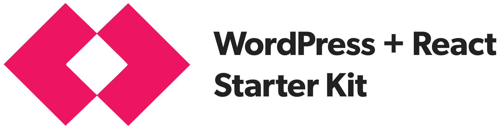

Postlight's Headless WordPress + React Starter Kit is an automated toolset that will spin up two things:

1. A WordPress backend that serves its data via the [WP REST API](https://developer.wordpress.org/rest-api/).
2. A server-side rendered React frontend using [Next.js](https://github.com/zeit/next.js/).

You can read all about it in [this handy introduction](https://trackchanges.postlight.com/introducing-postlights-wordpress-react-starter-kit-a61e2633c48c).

**What's inside:**

* An automated installer script which bootstraps a core WordPress installation.
* The WordPress plugins you need to set up custom post types and custom fields ([Advanced Custom Fields Pro](https://www.advancedcustomfields.com/) and [Custom Post Type UI](https://wordpress.org/plugins/custom-post-type-ui/)).
* Plugins which expose those custom fields and WordPress menus in the [WP REST API](https://developer.wordpress.org/rest-api/) ([ACF to WP API](https://wordpress.org/plugins/acf-to-wp-api/) and [WP-REST-API V2 Menus](https://wordpress.org/plugins/wp-rest-api-v2-menus/)).
* All the starter WordPress theme code and settings headless requires, including pretty permalinks, CORS `Allow-Origin` headers, and useful logging functions for easy debugging.
* A mechanism for easily importing data from an existing WordPress installation anywhere on the web using [WP Migrate DB Pro](https://deliciousbrains.com/wp-migrate-db-pro/) and its accompanying plugins (license required).
* A starter frontend React app powered by [Next.js](https://learnnextjs.com/).
* A [Docker](https://www.docker.com/) container and scripts to manage it, for easily running the frontend React app locally or deploying it to any hosting provider with Docker support.

Let's get started.

## WordPress Backend

Before you install WordPress, make sure you have all the required software installed for your operating system.

### Prerequisites

* **OS X:** You'll need [Homebrew](https://brew.sh/) and [Yarn](https://yarnpkg.com/en/) installed.
* **Windows:** To install under Windows you need to be running the _64-bit version of Windows 10 Anniversary Update or later (build 1607+)_. The [Linux Subsystem for Windows](https://msdn.microsoft.com/en-us/commandline/wsl/install_guide) should be installed and enabled before proceeding. Then, you'll need the prerequisites for Ubuntu Linux, detailed below, set up.
* **Ubuntu Linux:** You'll need the latest version of NodeJS, Yarn and debconf-utils installed first. Follow this [simple guide](https://nodejs.org/en/download/package-manager/#debian-and-ubuntu-based-linux-distributions) to get the latest version of NodeJS installed. Install the rest of the packages using the `apt-get` package manager. _Note: During the WordPress installation, you may be asked to enter the root password at the prompt due to the use of the `sudo` command_

### Install

The following command will get WordPress running locally on your machine, along with the WordPress plugins you'll need to create and serve custom data via the WP REST API.

```zsh
> yarn install && yarn start
```

When the installation process completes successfully:

* The WordPress REST API is available at [http://localhost:8080](http://localhost:8080)
* The WordPress admin is at [http://localhost:8080/wp-admin/](http://localhost:8080/wp-admin/) default login credentials `nedstark` / `winteriscoming`

### Import Data (Optional)

To import data and media from a live WordPress installation, you can use the Migrate DB Pro plugin, which is already installed. To do so, in the `robo.yml` file, set the plugin license and source install. Run `robo wordpress:setup`, then run `robo wordpress:import` to pull in the data.

### Extend the WordPress API

At this point you can start setting up custom fields in the WordPress admin, and if necessary, creating [custom REST API endpoints](https://developer.wordpress.org/rest-api/extending-the-rest-api/adding-custom-endpoints/) in the Postlight Headless WordPress Starter theme. The primary theme code is located in `wordpress/wp-content/themes/postlight-headless-wp`. As you modify the theme code, be sure to [use WordPress coding standards](https://github.com/postlight/headless-wp-starter/blob/master/wordpress/wp-content/themes/postlight-headless-wp/README.md).

## React Frontend

To spin up the frontend client app, run the following commands:

```zsh
> cd frontend && yarn install && yarn run dev
```

The Next.js app will be running on [http://localhost:3000](http://localhost:3000).

### Docker

Most WordPress managed hosting services don't also host Node applications, so usually you will need another service to run the client app. That's why we've packaged the frontend app in a Docker container, which can be run locally or deployed to a hosting provider with Docker support like AWS Elastic Beanstalk.

Once you have [Docker](https://www.docker.com/) installed on your computer, you can run the container locally using this command:

```zsh
> yarn run deploy
```

---

Made with ❤️ by [Postlight](https://postlight.com). Happy coding!
